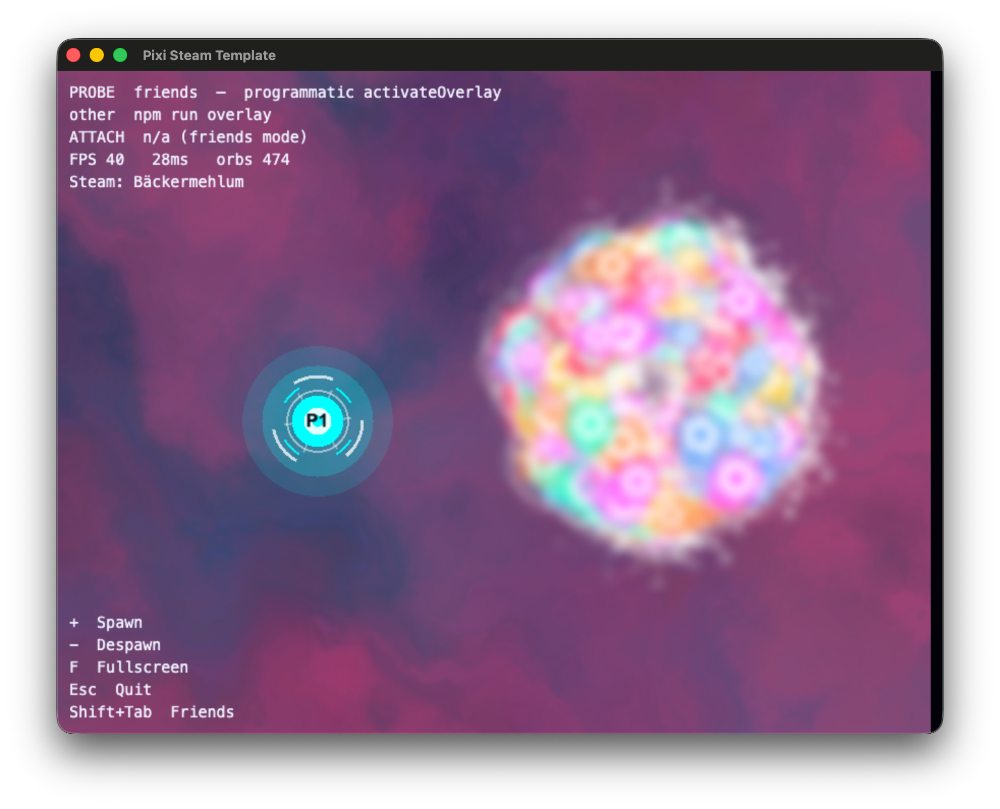

# steam-electron-build

Ship any HTML5/WebGL game to Steam with Electron — PixiJS, Phaser, Three.js, vanilla, anything that builds to a `dist/` folder. One command on your machine, the same command in CI.

```bash
npm i -D github:alexanderthurn/steam-electron-build
npx steam-electron-build dev          # your game in Electron, with real Steam
npx steam-electron-build win          # depot-ready folder in dist-electron/win  (mac | win | linux)
```

Installed straight from GitHub, not the npm registry — see the redistributables
note below for why. npm records the exact commit in your lockfile; `npm update
steam-electron-build` re-resolves it to the branch head. The version field is
therefore not what consumers resolve on, so bump it in the same commit as a
change or two different code states end up wearing the same number.

No config needed to start: it defaults to Steam's public test app **480 (Spacewar)**, so Steam integration works on any machine with the Steam client running — no Steamworks partner account required for testing.

Steamworks redistributables (`libsteam_api` / `steam_api64.dll`) live under
`steamworks_sdk/redistributable_bin/` in this package (or your game root).
Valve's [SDK Access Agreement](https://partner.steamgames.com/documentation/sdk_access_agreement)
only licenses shipping that folder **with your software** — not the rest of the
SDK. This repo keeps just `redistributable_bin` (we hold a Steamworks license)
and stays off the npm registry so those binaries are not published as a
registry package.

Uses **[steamworks-ffi-node](https://github.com/ArtyProf/steamworks-ffi-node)** (Steamworks SDK **1.64** redistributables) for lobbies, achievements/stats, and modern **ISteamNetworkingSockets** P2P.

Steam Overlay: games should use the **programmatic** API (`activateOverlay()` /
Friends / invite / store) — Shift+Tab via that path is what `npm run friends`
exercises. That is the reliable path on macOS today (see status below).

steamworks-ffi-node also has a **native mirror** (`addElectronSteamOverlay`): a
second **borderless** Metal/GL window that copies Electron frames so Steam can
inject ([write-up](https://dev.to/arty_prof/steamworks-ffi-node-a-steamworks-sdk-library-for-javascript-game-frameworks-15h1)).
That second window is required by the design. The example’s `npm run overlay`
turns it on on every OS as a **probe** — not the default ship path.

Extracted from a shipped Steam game ([DICEPTION](https://store.steampowered.com/app/3689240/)), so the annoying parts are already solved:

- **Achievements, stats, player identity** exposed to your game as `window.steam`
- **Steam Deck / Steam Linux Runtime fixes** — library path ordering, sandbox/zygote switches, clean process exit so Steam notices the game closed
- **Cloud-syncable JSON save file** in the platform app-data dir
- **GitHub Actions**: a reusable workflow that builds all three platforms and uploads to Steamworks

## Requirements

- Node 22+
- Steam client installed and running (only for testing Steam features — without it the game still runs)

## Try the example

A PixiJS v8 demo in [`example/`](example) is the **Steam overlay probe** for this
machine: FPS HUD, plasma background, mouse-swarm orbs (`=/+` / `-`), reactor-style
players, key legend bottom-left.



```bash
npm install      # the package's own deps (only needed for the file:.. link)
cd example
npm install
npm run friends  # programmatic Friends (activateOverlay on Shift+Tab)
npm run overlay  # native Metal/GL mirror probe on this OS (incl. macOS)
```

### macOS status (2026-08-16)

Tested with **steamworks-ffi-node 0.11.1**, Electron from this package, Steam
running, Spacewar (480):

| Path | Command | What you get on Mac today |
|---|---|---|
| **Friends (ship path)** | `npm run friends` | Works. One normal Electron window. Shift+Tab → programmatic Friends via `activateOverlay()`. Steam identity, achievements, FPS stress demo all fine. **Use this for real games.** |
| **Native overlay (probe)** | `npm run overlay` | Probe only. ffi-node attaches a **second borderless Metal mirror** (required — Chromium cannot host Steam’s injector). On Mac that mirror often sits **offset under** the Electron window (“two textures”), and **Shift+Tab does not reliably open** the injected overlay when launched via `npm run`. Older 0.10.x capture paths also hit `No texture… texture=0x0`; 0.11.x feeds frames better but does not fix Mac Shift+Tab / dual-window UX. |

So on macOS: **friends = supported**, **overlay = diagnostic** (see if *this* machine’s stack attaches; do not treat a green `ATTACH ok` as “players get a good Shift+Tab”). Windows/Linux may fare better on the mirror path; still not the default ship recommendation.

In overlay mode the HUD reports whether `addElectronSteamOverlay` **attached**.
Expect a second borderless mirror — that is the surface Steam would inject into.

## Using it in your game

Your game keeps being a normal web project. Steam features are available two ways:

**Globals** (no import, any framework): the preload script injects `window.steam`, `window.electronStorage`, `window.electronWin`, `window.openUrl` — all `undefined` in a plain browser, so guard with `?.`.

**Or the helper module** (safe no-ops in the browser, so `vite dev` keeps working untouched):

```js
import { steam, storage, toggleFullscreen, openUrl } from 'steam-electron-build/native';

const name = await steam.getUserName();        // '' in browser
await steam.unlockAchievement('ACH_FIRST_WIN');
await steam.setStat('STAT_GAMES_PLAYED', 42);

await storage.save({ level: 3 });              // JSON file under Electron, localStorage in browser
const data = await storage.load();
```

### Lobbies + P2P networking

For multiplayer games: Steam lobbies for matchmaking/invites, and Steam's
own P2P transport (relay-backed — no STUN/TURN, no self-hosted signaling
server) for the actual traffic. Every id (lobby, steamId64) is a decimal
string on this side of the bridge, never a bigint — safe to pass around,
JSON-stringify, and compare with `===`.

```js
import { lobby, net } from 'steam-electron-build/native';

// host: 'private' for a direct friend invite (not returned by getLobbies),
// 'public' for anonymous quick-match / auto-discovery
const room = await lobby.create('private', 4);   // { id, memberCount, memberLimit, owner, data }
lobby.openInviteDialog();                        // Steam's own overlay invite picker

// join by lobby id (e.g. from a "Join Game" accept, see onJoinRequested below)
await lobby.join(someLobbyId);

lobby.onChatUpdate(() => { /* a member joined/left — re-read lobby.getMembers() */ });
lobby.onJoinRequested(({ lobbySteamId }) => lobby.join(lobbySteamId));

// discover open public lobbies (no server-side filtering — filter client-side
// on whatever you stored via lobby.setData/mergeFullData)
const openRooms = await lobby.getLobbies();

// P2P: send any JSON-serializable payload to a member's steamId64
await net.send(someSteamId64, { type: 'hello' });
net.onData(({ steamId64, data }) => console.log('from', steamId64, data));

// A peer's connection ended: `graceful` true = closed cleanly by them,
// false = a problem detected locally (timeout, unreachable). Sending to
// that steamId64 again just dials a new connection.
net.onClosed(({ steamId64, graceful }) => console.log('gone', steamId64, graceful));
```

```js
// The player's friends, and inviting one straight into your lobby
import { friends, lobby } from 'steam-electron-build/native';

for (const f of await friends.list()) {
    // f = { steamId64, name, state, inThisGame }
    if (await lobby.inviteUser(f.steamId64)) console.log('invited', f.name);
}
```

`friends.list()` reports `inThisGame` (playing it right now) because Steam has
no ownership API — who owns your app is private. Invite anyone regardless;
Steam decides what they can do with it. `lobby.inviteUser()` needs no overlay,
which matters because `lobby.openInviteDialog()` can only show friends Steam is
willing to list — for a playtest or an unreleased app that is often nobody.

`net.onClosed` lets you react the moment Steam reports a peer gone instead of
waiting out your own keepalive — but it is a hint, not a complete disconnect
signal. A hard kill (power loss, SIGKILL) produces no callback at all, so keep
an application-level keepalive as the backstop and treat this as a speed-up
for the common cases.

Everything here is `undefined`/a safe no-op/an empty result in a plain
browser too, same as the rest of this module — `lobby.isAvailable()` /
`net.isAvailable()` if you need to branch explicitly (e.g. to fall back to
your own web-only matchmaking, like WebRTC + a small backend, when not
running under Steam).

### LAN (offline PeerJS + room list)

Opt-in local PeerServer + UDP broadcast discovery for LAN parties / offline.
**Off by default** — set `"lan": true` or the feature never opens ports and
`lan.isAvailable()` stays false.

```jsonc
"steamElectronBuild": {
  "lan": true                 // required to enable
  // "lanDiscoveryPort": 41234  // optional UDP port (default 41234)
}
```

```js
import { lan } from 'steam-electron-build/native';
import Peer from 'peerjs';

if (await lan.isAvailable()) {
  // host
  const room = await lan.startHost({ name: 'Alice', peerId: 'alice', maxPlayers: 4 });
  const peer = new Peer(room.peerId, { host: room.host, port: room.port, path: room.path });

  // guest
  const rooms = await lan.listRooms(); // CS-style LAN list for this appId
  const join = rooms[0];
  const guest = new Peer({ host: join.host, port: join.port, path: join.path });
  guest.connect(join.peerId);
}
```

Filtered by your `appId`, so different games on the same LAN don't mix.
Call `lan.stopHost()` when leaving the lobby (also runs on app quit).

### Config

All optional, in your `package.json`:

```jsonc
"steamElectronBuild": {
  "productName": "My Game",          // default: package name
  "appId": "com.studio.mygame",      // bundle identifier (also the save folder name)
  "steamAppId": 1234567,             // default: 480 (Spacewar)
  "steamBranchApps": {               // optional: which app a v* tag ships to,
    "main": 1234567,                 //   by the branch the tagged commit is on
    "demo": 1234570,                 //   (upstream branches first)
    "playtest": 1234580
  },
  "executableName": "mygame",        // linux binary name
  "dist": "dist",                    // your web build output dir
  "icon": "icon.png",                // 512x512 png (all platform icons derive from it)
  "extend": "steam-electron-build.extend.cjs",  // optional main-process hook, see below
  "macUniversal": false,             // build mac as x64+arm64 so Intel Macs work (default false)
  "fullscreen": true,                // first-launch window mode (default true)
  "uiScale": true,                   // false disables high-DPI page zoom (default on)
  "lan": false,                      // opt-in LAN PeerServer + UDP discovery (default false)
  "lanDiscoveryPort": 41234          // optional; only used when lan is true
}
```

`steam-electron-build dev` and `steam-electron-build build` run your `npm run build` first if the script exists, then wrap whatever is in the dist dir.

### Escape hatch

If your game needs a custom IPC handler or direct `steamworks.js` access, put a `steam-electron-build.extend.cjs` next to your package.json — it runs in the Electron main process:

```js
module.exports = ({ app, ipcMain, getSteam, getWindow }) => {
    ipcMain.handle('my:thing', () => getSteam()?.localplayer.getLevel());
};
```

## GitHub Actions

Add one file to your game repo, `.github/workflows/steam.yml`:

```yaml
name: Steam
on:
  push:
    tags: ['v*']
  workflow_dispatch:
jobs:
  steam:
    uses: alexanderthurn/steam-electron-build/.github/workflows/steam.yml@main
    secrets: inherit
```

Every run builds Windows, macOS and Linux and uploads them as artifacts. On a `v*` tag it additionally publishes to Steam via [game-ci/steam-deploy](https://github.com/game-ci/steam-deploy) — set these repo secrets:

| Secret | Value |
|---|---|
| `STEAM_USERNAME` | Steamworks build account |
| `STEAM_CONFIG_VDF` | see the [steam-deploy docs](https://github.com/game-ci/steam-deploy#configvdf) |
| `STEAM_APP_ID` | your app id — only when `steamBranchApps` is absent |

Depot mapping follows the steam-deploy convention: depot ids appid+1 (win), +2 (mac), +3 (linux). Since CI just runs `npx steam-electron-build build`, a CI build and a local build are identical by construction.

The build is set live on Steam's `develop` branch; pass `with: { release-branch: … }` for anything else. (`STEAM_RELEASE_BRANCH` is no longer read.) Steam refuses to let steamcmd set a **default** branch live, so `public` stays a click in App Admin → Builds.

### One workflow, several apps

A game, its demo and its playtest are separate Steam apps with separate depots but the same build. Map branch → app in `package.json` and the workflow routes each tag by the branch its commit is on:

```jsonc
"steamBranchApps": { "main": 1234567, "demo": 1234570, "playtest": 1234580 }
```

A `v*` tag on `playtest` then uploads to 1234580 (depots …81/82/83), one on `main` to 1234567 — same workflow, same secrets, nothing branch-specific in the game repo. List the branches in **merge order, upstream first**: `main` flows down into `demo` and `playtest`, so a commit on `main` is contained by all three and the first listed match wins. A tag on a branch that is in no map entry fails the run rather than guessing. The corollary: a downstream branch only claims a tag once it has a commit the trunk does not — a `playtest` sitting exactly on `main` *is* main, so merge into it before tagging.

Demos and playtests need their **own** depots. A shared depot from the base app is only licensed to owners of that app — a playtester who owns only the playtest downloads nothing and Steam reports a missing executable — and Steamworks refuses depot sharing from an unreleased app outright.

## Steam release checklist (once per game)

1. Steamworks partner portal: create the app + three depots (win/mac/linux)
2. Set `steamAppId` in your `steamElectronBuild` config
3. Steamworks → Installation → General: add a launch option per OS — `<productName>.exe`, `<productName>.app`, and the **lowercase** `executableName` for Linux, each with its `oslist` set. Publish it: an unpublished launch option is an unlaunchable game.
4. Add the workflow + secrets above
5. `git tag v1.0.0 && git push --tags`
6. Steamworks → Builds: set the build live on the branch you want (the default branch cannot be set live from CI)

## High-DPI UI scaling

A 4K display with OS scaling at 100% renders HTML UI at tiny physical sizes
while the 3D canvas is unaffected. The page is zoomed to a 1280x800 reference,
never below 1 — so 3840x2160 gets 2.7x, 1920x1080 gets 1.35x, and a 1280x800
Steam Deck gets 1x. Set `"uiScale": false` if your game scales itself.

Games can offer this as a player setting: `win.setUiScale(1.25)` multiplies the
automatic factor, so the display-derived part still adapts underneath whatever
the player picked. Pair it with a render-scale setting expressed as a *fraction
of native* (`devicePixelRatio × fraction`) — a `devicePixelRatio` **cap** instead
makes the two interfere, because enlarging the UI shrinks the CSS viewport and
would silently lower the 3D resolution.

Chromium's zoom applies beneath the coordinate system, so pointer coordinates,
`getBoundingClientRect` and `devicePixelRatio` stay consistent. A CSS transform
on `<body>` looks the same but desyncs element rects from canvas pixels, which
silently breaks pointer-to-world math in games that subtract a rect origin
without dividing by the scale.

The canvas sizes to the zoomed viewport, so its backing store is
`cssSize x devicePixelRatio`. A game capping DPR below the zoom factor renders
below native resolution — sharper UI, slightly softer 3D.

## Window state

The window starts fullscreen (set `"fullscreen": false` to start windowed) and
its size, position and mode are remembered in `window-state.json` in the
app-data dir. `F11` / `Alt+Enter` toggle it, and the new mode is what the next
launch uses.

That file is deliberately **not** a `.sav`: geometry is machine-specific, so a
desktop's 2560x1440 bounds arriving on a 1280x800 Steam Deck through Steam Cloud
would put the window off the screen. Restored bounds are also clamped to a
display that currently exists, so unplugging a monitor or changing resolution
falls back to the default size rather than opening off-screen.

## Debugging a packaged build

`F12` opens devtools. In a packaged build it is ignored unless you opt in, since
players should not be able to open it by accident:

```bash
STEAM_ELECTRON_DEVTOOLS=1 ./YourGame        # env var
./YourGame --devtools                       # or a flag
```

Use the flag from Steam: **Properties → Launch Options → `--devtools`**, since
Steam passes arguments, not environment variables. Bugs that only appear in a
shipped build — asar paths, install directories containing spaces or `(x86)` —
are otherwise invisible.

## Steam Deck notes

The Linux build runs inside the Steam Linux Runtime. The runtime applies the required Electron switches (`no-sandbox`, `no-zygote`, `in-process-gpu`, `disable-dev-shm-usage`) and prepends the bundled `libsteam_api.so` to `LD_LIBRARY_PATH` before `steamworks.js` loads. These look arbitrary but each one fixes a real Steam Deck failure — they're the main reason this package exists.

## License

MIT
